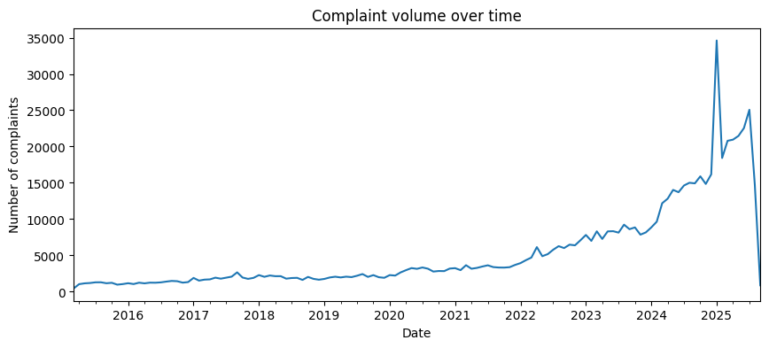
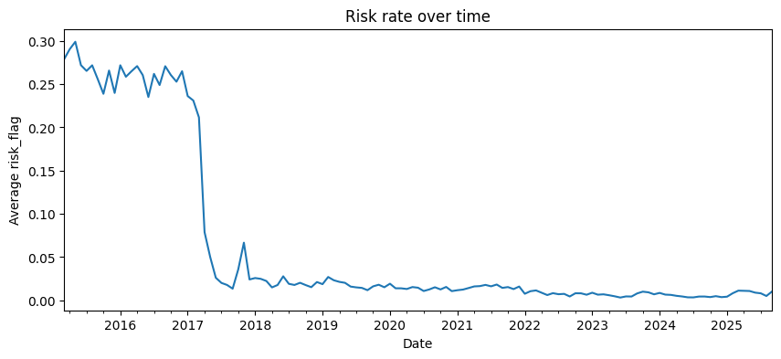
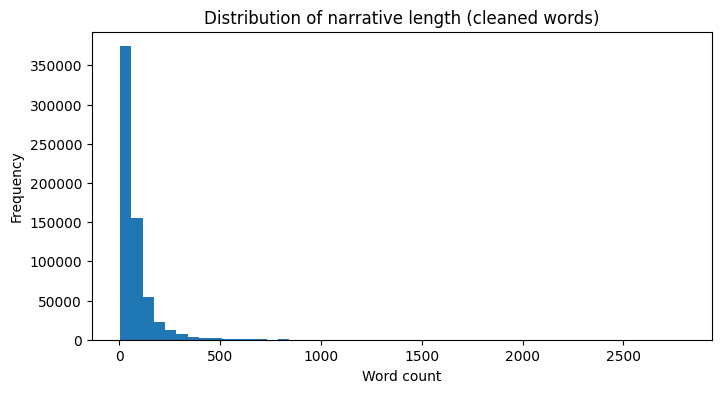
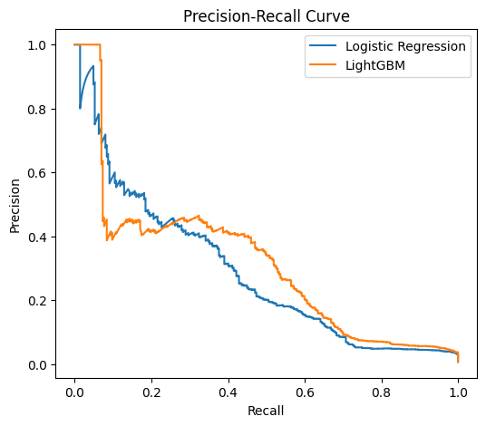
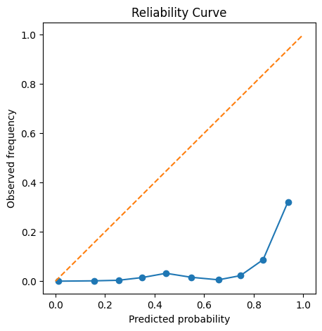
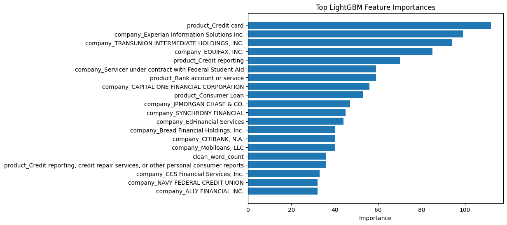
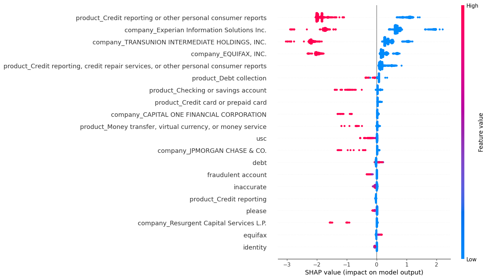
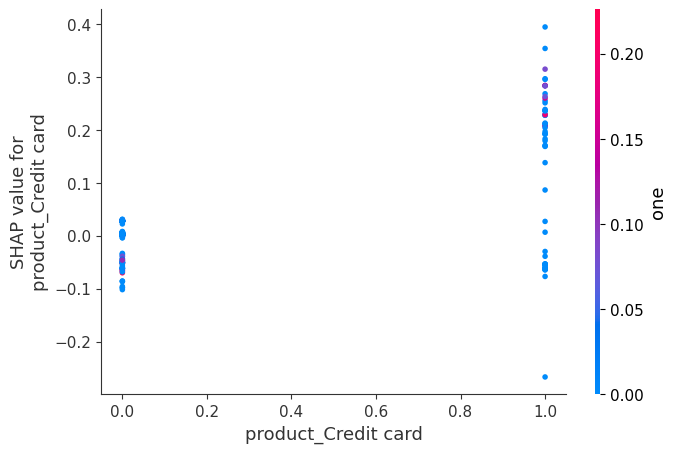
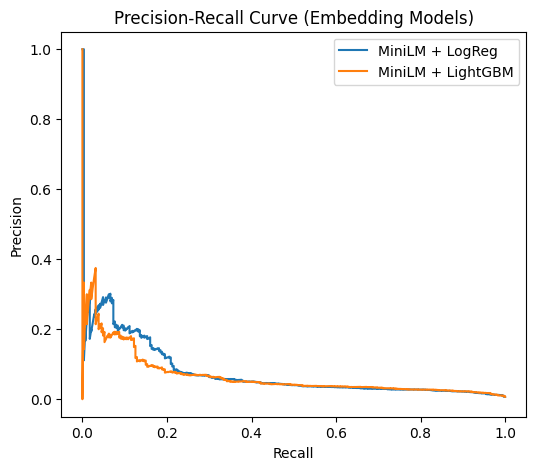
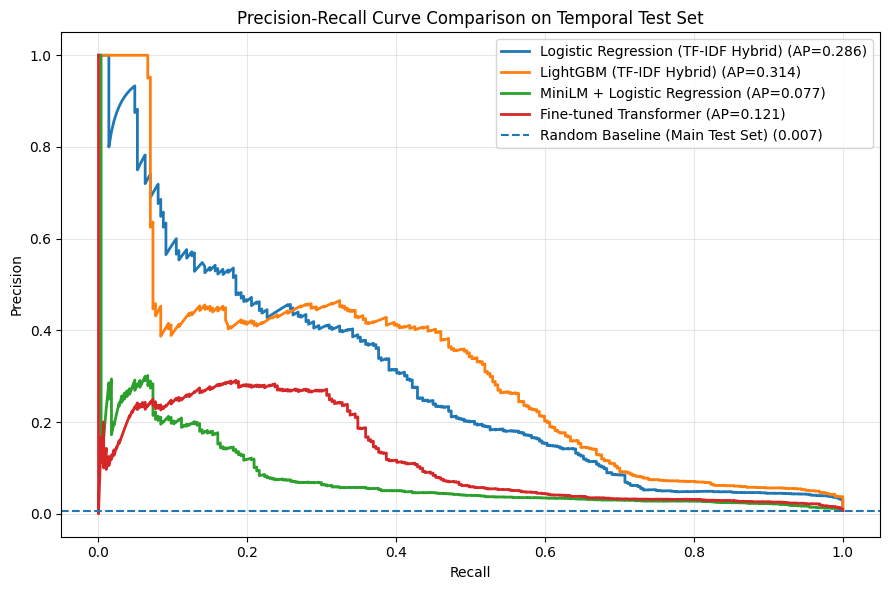

# Credit-Risk Early Signals from CFPB Consumer Complaints

## Project Overview
This project builds an early-warning machine learning pipeline to detect elevated credit-risk signals from CFPB consumer complaint narratives. The goal is not to predict confirmed fraud directly, but to identify complaints associated with risky downstream outcomes using proxy supervisory signals derived from complaint resolution fields.

## Business Objective
Financial institutions receive large volumes of consumer complaints, but only a small fraction may indicate meaningful operational, compliance, or credit-risk concerns. A model that flags high-risk complaint narratives can support:
- early triage and prioritization,
- faster manual review,
- downstream risk monitoring,
- and more interpretable complaint surveillance.

## Modeling Objective
Using complaint text, product metadata, company identity, and state-level information, the task is to predict a proxy risk label (`risk_flag`) built from post-complaint outcomes such as dispute and untimely response. Because the positive class is rare, the project emphasizes rare-event evaluation, threshold selection, interpretability, and deployment-oriented validation.

## What this notebook includes
This notebook covers:
1. data loading and sharding,
2. text preprocessing and proxy label construction,
3. temporal train/test splitting,
4. feature engineering with TF-IDF, metadata, and domain lexicons,
5. classical ML baselines and hybrid models,
6. embedding-based and fine-tuned transformer models,
7. model interpretability with coefficients and SHAP,
8. threshold optimization and cost-sensitive evaluation,
9. calibration analysis,
10. robustness checks including cross-product generalization.

## Final Takeaway
The strongest overall model in this workflow is an interpretable logistic regression model using lexicon and structured features, with LightGBM as a high-performance challenger. The overall pipeline is designed to demonstrate practical data science, applied NLP, and risk-modeling skills relevant to credit, fraud, and financial decision-support teams.
## 2. Text preprocessing and proxy label construction

This section prepares the raw CFPB complaint shard for modeling.

The preprocessing pipeline includes:
- standardizing column names,
- parsing dates,
- cleaning and normalizing complaint narratives,
- removing rows without usable text,
- constructing a proxy risk target (`risk_flag`),
- and creating early domain features such as sentiment and urgency/dispute indicators.

### Proxy target definition
The target in this project is a **proxy risk label**, not a direct fraud outcome. A complaint is labeled as `risk_flag = 1` if it is associated with at least one downstream risk-related signal, such as:
- the consumer disputed the company response, or
- the company response was marked untimely.

This framing is useful for early-warning complaint triage in risk-monitoring settings.

### Why this matters
Consumer complaint text is noisy, inconsistent, and highly imbalanced. Careful preprocessing is essential before building rare-event models for risk detection.
## 3. Temporal train/test split and exploratory analysis

Because complaint data evolves over time, evaluating models with a random split can lead to overly optimistic performance estimates. Instead, this project uses a **temporal split** that mimics real-world deployment.

### Temporal validation strategy
The dataset is divided using a cutoff date:

- **Training set:** complaints received before the cutoff  
- **Test set:** complaints received on or after the cutoff  

This ensures that models are evaluated on **future complaints**, preventing leakage from future information.

### Why this matters for risk modeling
In financial applications such as credit risk or fraud detection, models are deployed to score **future events**, not randomly sampled historical observations. Temporal validation better reflects how models behave in production.

### Rare-event modeling
The target variable `risk_flag` is highly imbalanced. Therefore, evaluation focuses on:

- **PR-AUC** (precision–recall AUC)
- **threshold optimization**
- **recall-oriented metrics**

rather than relying solely on ROC-AUC.

### Exploratory goals
This section examines:

- class imbalance
- complaint volume over time
- risk rate over time
- distribution across products and companies

## 4. Feature engineering

This section converts the cleaned complaint data into machine learning features.

The project combines **multiple feature families** to capture different types of signals:

### 1. Text features
The complaint narratives are transformed using **TF-IDF vectorization**.  
This captures important words and phrases that indicate potential risk signals in consumer complaints.

Example patterns:
- dispute language
- identity theft / unauthorized activity
- account closure or incorrect balances

### 2. Structured metadata
Additional context is captured through structured variables:

- product
- company
- state

These are encoded using **one-hot encoding**.

### 3. Domain features
Additional handcrafted signals include:

- sentiment scores from the complaint narrative
- urgency indicators
- dispute keyword counts

These features help capture domain knowledge about complaint severity.

### Final feature matrix
The final model input combines:

- TF-IDF text features
- structured metadata
- domain features

This hybrid approach balances **predictive performance and interpretability**, which is important for risk modeling applications.
## 5. Baseline models and rare-event evaluation

This section trains baseline machine learning models for the complaint risk prediction task.

Two model families are used:

### Logistic Regression
Logistic regression is widely used in financial modeling because it provides:

- strong performance with sparse features
- interpretability through coefficients
- straightforward probability outputs

### LightGBM
LightGBM is used as a nonlinear challenger model. Tree-based models can capture:

- nonlinear interactions
- feature combinations
- complex patterns in high-dimensional data

### Class imbalance handling
The target variable is highly imbalanced, so models use class weighting or `scale_pos_weight` to correct for the rare positive class.

### Evaluation metrics
Because this is a rare-event problem, we emphasize:

- **PR-AUC (Precision–Recall AUC)**
- **F2 score**
- **threshold optimization**
- **cost-based evaluation**

rather than relying only on ROC-AUC.

### Probability calibration
For deployment in risk monitoring systems, probability estimates must be reliable. Therefore this section also evaluates:

- Brier score
- reliability curves
- calibrated probability models

## 6. Model interpretability and feature importance

In financial risk modeling, interpretability is critical.  
Stakeholders must understand why a model flags certain cases as risky.

This section analyzes model behavior using three approaches:

### Logistic Regression Coefficients
Logistic regression provides direct interpretability through model coefficients.  
Positive coefficients increase predicted risk, while negative coefficients decrease risk.

### Tree-based Feature Importance
LightGBM feature importance highlights which variables contribute most to model decisions.

### SHAP Analysis
SHAP (SHapley Additive exPlanations) provides a unified framework for explaining model predictions.  
It quantifies the contribution of each feature to individual predictions.

Interpretability is essential for:

- regulatory compliance
- model validation
- stakeholder trust
- diagnosing model bias

## 7. Dense semantic embeddings with MiniLM

Sparse text features such as TF-IDF are often strong baselines, especially in risk modeling tasks with domain-specific vocabulary. However, they may miss deeper semantic similarity across complaints.

To test whether dense semantic representations improve performance, this section uses **MiniLM sentence embeddings**.

### Why embeddings?
MiniLM embeddings convert each complaint narrative into a dense vector representation that captures semantic meaning beyond individual keywords.

This allows the project to compare:

- sparse lexical features (TF-IDF)
- dense semantic features (MiniLM embeddings)

### Experimental goal
The goal is to evaluate whether embedding-based models improve performance over the stronger interpretable baselines built earlier.

### Models tested
Two classical models are trained on MiniLM embeddings:

- Logistic Regression
- LightGBM

This comparison helps determine whether semantic embeddings outperform sparse hybrid feature pipelines in this task.

## 8. Fine-tuned transformer classifier

While MiniLM embeddings provide strong semantic representations, they remain **static features** when used with classical models.

This section evaluates a **fine-tuned transformer classifier**, where the language model itself is trained on the complaint classification task.

### Why fine-tuning?
Fine-tuning allows the model to adapt to domain-specific language patterns such as:

- dispute descriptions
- identity theft reports
- credit reporting errors
- collection complaints

### Training approach
Because transformer models are computationally expensive and the dataset is highly imbalanced, training uses a **balanced subset of the data**.

This allows the model to learn meaningful patterns while remaining computationally feasible in a notebook environment.

### Goal of this experiment
The goal is to compare whether **fine-tuning improves performance beyond:**

- sparse TF-IDF hybrid models
- MiniLM embedding models

This helps evaluate whether deep models provide additional value in this complaint-risk detection task.
## 9. Cross-product generalization and domain shift

Models trained on historical complaint data may rely heavily on product-specific language patterns.  
However, in real financial environments, models are often applied to **new complaint categories or evolving products**.

This section evaluates **domain robustness** by testing whether models trained on one product group generalize to another.

### Experiment design

1. Train a model using complaints from **one product family**.
2. Evaluate the model on complaints from a **different product family**.

This helps determine whether the model captures **general complaint risk signals** or relies heavily on **product-specific vocabulary**.

### Why this matters
For real-world deployment:

- Models should generalize across complaint categories.
- Heavy reliance on product identifiers may reduce portability.
- Domain shift analysis helps assess how models behave outside the training distribution.

## 10. Final conclusions

This project built an end-to-end machine learning pipeline for detecting elevated credit-risk signals from consumer complaint narratives.

### Key findings

**1. Hybrid sparse models performed strongly**

Logistic regression using TF-IDF text features combined with structured metadata and domain features achieved strong performance while remaining interpretable.

**2. Gradient boosting provided a competitive nonlinear alternative**

LightGBM captured feature interactions but offered less transparency compared to logistic regression.

**3. Dense embeddings did not consistently outperform sparse lexical features**

MiniLM embeddings captured semantic information but did not significantly outperform the strongest TF-IDF hybrid models.

**4. Transformer fine-tuning improved semantic understanding**

Fine-tuned transformer models demonstrated competitive performance but require greater computational resources.

**5. Domain shift affects model portability**

Cross-product experiments showed reduced performance when models trained on one complaint category were applied to another, highlighting the importance of domain-specific adaptation.

### Practical implications

For real financial complaint monitoring systems:

- interpretable logistic regression models remain strong baselines
- hybrid feature pipelines balance performance and transparency
- transformer models can provide improvements when computational resources allow
- domain shift should be monitored when deploying models across product categories

### Skills demonstrated

This project demonstrates practical data science capabilities including:

- large-scale text preprocessing
- rare-event classification
- feature engineering for financial text
- model comparison across classical and deep learning approaches
- probability calibration and threshold optimization
- model interpretability using coefficients and SHAP
- robustness analysis under domain shift
